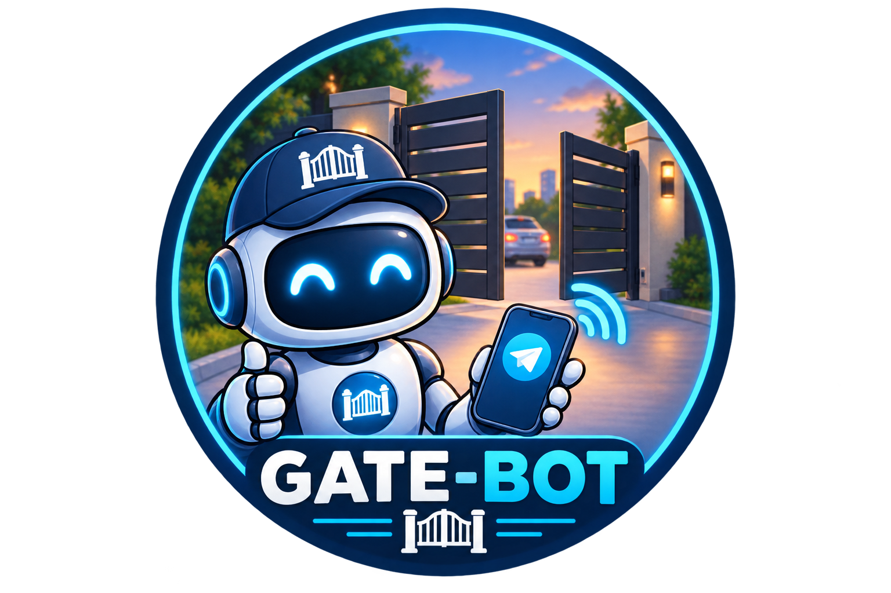

# gate-bot

<p align="center">
  
</p>

This project allows authorized users to open a gate. It comes with an optional Telegram bot (built with the Telegraf framework) and an optional web UI, and supports both HTTP and MQTT for integration with Home Assistant.

The Telegram bot and the web UI are independent modules — you can run any combination of them:

- **Telegram only**: set `BOT_TOKEN` and the web is disabled.
- **Web only**: set `WEB_ENABLED=true` without a `BOT_TOKEN`. Admins get notified through MQTT / Home Assistant and can approve or deny access requests from the web admin panel.
- **Both**: full setup with Telegram notifications and the web dashboard.

## Features

- **Authorization System**: Only authorized users can open the gate.
- **Request Access**: Users can request access to open the gate. The request is sent to the admins, who can either allow or deny the request.
- **Open the Gate**: Authorized users can open the gate via the `/open` command or the web dashboard.
- **Check Authorization**: Users can check if they are authorized to open the gate by sending the `/check_authorization` command.
- **Get the Door Code**: Authorized users can get the door code by sending the `/door_code` command.
- **Property Info**: View property details (door code, parking instructions, floor, unit) set via environment variables, accessible through the `/info` Telegram command or the web dashboard.
- **Supports Two Modes**:
  - **HTTP Mode**: Calls an HTTP endpoint to open the gate.
  - **MQTT Mode**: Uses MQTT to communicate with Home Assistant.
- **Web UI**: A built-in web server with Google login for both users and admins.
  - **User Dashboard**: Open the gate, check status, request access via browser.
  - **Admin Panel**: Approve/deny access requests and manage users from the web.
  - Requests from both Telegram and web are visible in a single admin panel.

## Setup

### Docker Compose

```yml
version: '3.8'

services:
  gate-bot:
    image: noamokman/gate-bot
    container_name: gate-bot
    environment:
      DB_PATH: /config/db.json
      BOT_TOKEN: ${BOT_TOKEN}
      ADMIN_USER_IDS: ${ADMIN_USER_IDS}
      GATE_URL: ${GATE_URL} # Required for HTTP mode
      DOOR_CODE: ${DOOR_CODE}
      PARKING_INFO: ${PARKING_INFO}
      FLOOR: ${FLOOR}
      UNIT: ${UNIT}
      PROPERTY_NOTES: ${PROPERTY_NOTES}
      MQTT_URL: ${MQTT_URL} # Required for MQTT mode
      MQTT_COMMAND_TOPIC: ${MQTT_COMMAND_TOPIC} # Required for MQTT mode
      MQTT_DISCOVERY_TOPIC: ${MQTT_DISCOVERY_TOPIC} # Required for MQTT mode
      # Web UI (set WEB_ENABLED=true to enable)
      WEB_ENABLED: ${WEB_ENABLED}
      GOOGLE_CLIENT_ID: ${GOOGLE_CLIENT_ID}
      GOOGLE_CLIENT_SECRET: ${GOOGLE_CLIENT_SECRET}
      WEB_SESSION_SECRET: ${WEB_SESSION_SECRET}
      WEB_BASE_URL: ${WEB_BASE_URL}
      GOOGLE_ADMIN_EMAILS: ${GOOGLE_ADMIN_EMAILS}
      WEB_PORT: ${WEB_PORT}
    volumes:
      - ./config/:/config
    restart: unless-stopped
```

### Manual Setup

1. Clone the repository.
2. Install the dependencies:
   ```sh
   yarn install
   ```
3. Create a `.env` file in the root directory and set the following environment variables:

- `BOT_TOKEN`: Your Telegram bot token. Omit it to run without the Telegram bot (web-only mode).
- `ADMIN_USER_IDS`: A comma-separated list of Telegram user IDs of the admins. Only used when the Telegram bot is enabled.
- `DB_PATH`: Path to the database JSON file (e.g. `.local.db.json`).
- `DOOR_CODE`: The door code.
- `PARKING_INFO`: Parking instructions.
- `FLOOR`: Floor number.
- `UNIT`: Unit / apartment number.
- `PROPERTY_NOTES`: Any additional property notes.
- **For HTTP Mode:**
  - `GATE_URL`: The endpoint that gets called when an authorized user runs `/open`.
- **For MQTT Mode:**
  - `MQTT_URL`: The MQTT broker URL.
  - `MQTT_COMMAND_TOPIC`: The MQTT topic used to send open commands.
  - `MQTT_DISCOVERY_TOPIC`: The MQTT topic used for Home Assistant discovery.
- **For the Web UI (all required if `WEB_ENABLED=true`):**
  - `WEB_ENABLED`: Set to `true` to enable the web server (default `false`).
  - `GOOGLE_CLIENT_ID`: Your Google OAuth 2.0 client ID.
  - `GOOGLE_CLIENT_SECRET`: Your Google OAuth 2.0 client secret.
  - `WEB_SESSION_SECRET`: A random string used to sign session cookies.
  - `WEB_SESSION_PATH`: Path to the session storage directory (defaults to `<DB_PATH directory>/sessions`).
  - `WEB_BASE_URL`: The public URL of the web server (e.g. `https://gate.example.com` or `http://localhost:3000`).
  - `GOOGLE_ADMIN_EMAILS`: A comma-separated list of email addresses that have admin access on the web UI.
  - `BASIC_AUTH_USERS`: Optional. A semicolon-separated list of username,password,isAdmin tuples for password-based login (e.g. `admin,secret,true;user,pass,false`). **Not recommended for production** — intended for testing and local development only.

4. Run the bot:
   ```sh
   yarn start
   ```

## Usage

### Telegram Commands

| Command                | Description                                                 |
| ---------------------- | ----------------------------------------------------------- |
| `/start`               | Start the bot                                               |
| `/help`                | Get help on how to use the bot                              |
| `/check_authorization` | Check if you are allowed to open the gate                   |
| `/request_access`      | Request access to open the gate                             |
| `/open`                | Open the gate                                               |
| `/info`                | View property info (door code, parking, floor, unit, notes) |

### Web UI

The web server is started automatically when the Google OAuth environment variables are configured.

| Feature           | URL                                  | Access                                              |
| ----------------- | ------------------------------------ | --------------------------------------------------- |
| Login / Dashboard | `/` (dashboard shown when signed in) | Public for login; authenticated users for dashboard |
| Open Gate         | `/` (Open Gate button)               | Authorized users                                    |
| Property Info     | `/` (info card)                      | Authorized users                                    |
| Admin Panel       | `/admin`                             | Users with email in `GOOGLE_ADMIN_EMAILS`           |
| Pending Requests  | `/admin/pending`                     | Admins                                              |
| Manage Users      | `/admin/users`                       | Admins                                              |

**Flow for web users:**

1. Visit the site and sign in with Google.
2. If not yet authorized, click "Request Access".
3. An admin (via Telegram or the web admin panel) approves the request.
4. The user can now open the gate from the dashboard.

**Admin panel features:**

- View pending access requests from both Telegram and web users.
- Approve or deny requests with one click.
- View all authorized users and remove them if needed.

## MQTT Integration

### **Home Assistant Discovery**

The bot automatically publishes an MQTT discovery message so Home Assistant can detect it as an event. The discovery topic is set in the environment variable `MQTT_DISCOVERY_TOPIC`.

Example MQTT discovery topic:

```
homeassistant/event/gate_bot_event/config
```

Example payload sent to Home Assistant:

```json
{
  "name": "Gate Bot Event",
  "unique_id": "gate_bot_event",
  "event_types": ["gate_bot_triggered", "gate_open_failed", "access_request_created", "access_request_allowed", "access_request_denied"],
  "state_topic": "home/gate_bot/event",
  "value_template": "{{ value_json.event_type }}",
  "json_attributes_topic": "home/gate_bot/event",
  "device": {
    "identifiers": ["gate_bot"],
    "name": "Gate Bot",
    "manufacturer": "Custom",
    "model": "Gate Bot"
  }
}
```

### **Publishing MQTT Events**

The bot publishes domain events to the MQTT command topic defined by `MQTT_COMMAND_TOPIC`. All events include an `event_type`, `source` (`gate_bot`), and event-specific payload.

**Gate opened** — published when an authorized user opens the gate:

```
topic: home/gate_bot/event
payload: {
  "event_type": "gate_bot_triggered",
  "source": "gate_bot",
  "action": "open_gate",
  "userInfo": {
    "userId": "123456789",
    "username": "example_user",
    "firstName": "John",
    "lastName": "Doe",
    "sourceType": "telegram"
  }
}
```

The `userInfo.sourceType` field indicates where the open request originated — `"telegram"` for the Telegram bot or `"web"` for the web dashboard. This allows Home Assistant to trigger the gate opening automatically.

**Gate open failed** — published when opening the gate fails, with an `error` field describing the failure.

**Access request created** — published when a user requests access (via Telegram or web):

```json
payload: {
  "event_type": "access_request_created",
  "source": "gate_bot",
  "request": {
    "id": "telegram:123456789",
    "sourceType": "telegram",
    "sourceUserId": "123456789",
    "name": "John Doe",
    "username": "example_user",
    "requestedAt": "2026-08-15T12:00:00.000Z"
  },
  "url": "https://gate.example.com/admin/pending"
}
```

When the web UI is enabled (`WEB_ENABLED=true`), the payload includes a `url` field pointing to the admin "pending requests" page. This lets Home Assistant send a notification with a link back to the website, where the admin can approve or reject the request — useful when running in web-only mode without a Telegram bot.

**Access request allowed / denied** — published when an admin approves or denies a pending request, including the `request` and the resolving `admin` (name/email for web admins, user ID for Telegram admins).

### **Event-Driven Architecture**

All outbound notifications go through an internal event bus (`src/services/events.ts`). Telegram messages are sent exclusively by the Telegram listener in `src/services/telegram.ts`, and MQTT publishes are handled by the MQTT listener in `src/services/mqtt.ts`. This makes it easy to add new consumers (e.g. additional Telegram chats, logging, or home automation triggers) by subscribing to events.
